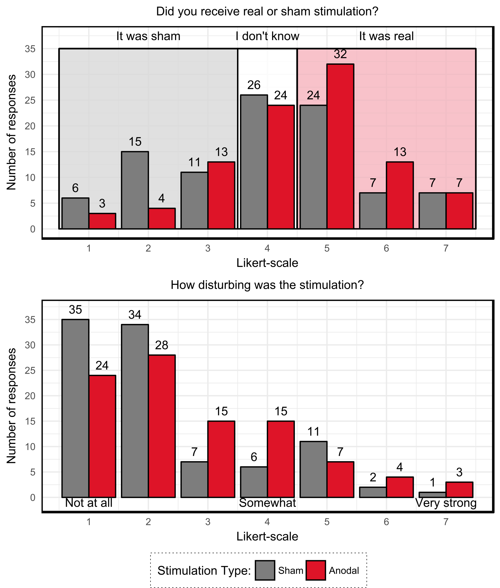

---
title:  'Compromised Effective Blinding for transcranial direct current stimulation at 1 mA for 20 min in Young Healthy Individuals'
journal: 'Brain Stimulation'
author:
- name: Zsolt Turi
  footnote: 2
- name: Gábor Csifcsák
  footnote: 1
- name: Nya Mehnwolo Boayue
  footnote: 1
- name: Per Aslaksen
  footnote: 1
- name: Andrea Antal
  footnote: 2
- name: Josephine Groot
  footnote: 1,3
- name: Guy E. Hawkins
  footnote: 4
- name: Birte Forstmann
  footnote: 3
- name: Alexander Opitz
  footnote: 5
- name: Axel Thielscher
  footnote: 6,7
- name: Matthias Mittner
  footnote: 1
  corresponding: matthias.mittner@uit.no
affiliation:
- number: 1
  name: Department of Psychology, University of Tromsø
- number: 2
  name: Department of Clinical Neurophysiology, University Medical Center Göttingen
- number: 3
  name: Integrative Model-based Cognitive Neuroscience Research Unit, University of Amsterdam
- number: 4
  name: School of Psychology, University of Newcastle
- number: 5
  name: Department of Biomedical Engineering, University of Minnesota
- number: 6
  name: Danish Research Centre for Magnetic Resonance, Copenhagen University Hospital Hvidovre
- number: 7
  name: Department of Electrical Engineering, Technical University of Denmark
keyword:
  - tDCS
  - blinding
  - active sham tDCS
abstract: |
  Transcranial direct current stimulation (tDCS) is a frequently used non-invasive brain stimulation method, which has the potential to modulate cortical excitability level and cognitive functions in humans. While most stimulators are can operate in double-blind mode, the amount of discomfort experienced during tDCS may break blinding. The goal of the study was to investigated the blinding efficacy of the so-called "fade-in, short-stimulation, fade-out" (FSF) active sham protocol against 1 mA-20 minutes real tDCS. We analyzed subjective reports of 192 volunteers, who either received 20 minutes of real tDCS at 1 mA (n=96) or FSF tDCS (n=96). Participants reported more intense discomfort for the real tDCS, when compared to the FSF protocol and correctly guessed the condition for the real tDCS. Our results suggest that blinding is compromised for 1 mA -20 minutes real tDCS. Developing active sham protocols for effectively blinding this commonly used real tDCS protocol is needed.
linenumbers: true
bibliography: references.bib 
acknowledgements: |
  We'd like to thank bla bla and blablab
contribution: | 
  Must include all authors, identified by initials, for example:
  A.A. conceived the experiment(s),  A.A. and B.A. conducted the experiment(s), C.A. and D.A. analysed the results.  All authors reviewed the manuscript.
additionalinformation: |
  To include, in this order: \textbf{Accession codes} (where applicable); \textbf{Competing financial interests} (mandatory statement).
  The corresponding author is responsible for submitting a \href{http://www.nature.com/srep/policies/index.html#competing}{competing financial interests statement} on behalf of all authors of the paper. This statement must be included in the submitted article file.
...

# Introduction

Low-intensity transcranial direct current stimulation (tDCS) is a non-invasive brain stimulation method, which applies constant current between two or more electrodes placed over the scalp [@antal2017low]. TDCS is typically applied at intensities between 1 and 2 mA, which induces moderate amount of adverse-effects that include cutaneous discomfort, such as itching or tingling sensations [@poreisz2007safety; @matsumoto2017adverse; @fertonani2015you].

Most tDCS studies use active sham stimulation protocols for placebo control [@davis2013challenges]. The aim of the active sham stimulation is to induce adverse-effects that are reminiscent of the real tDCS protocol without inducing the neurophysiologically relevant primary effects and after-effects [@woods2016technical]. The most frequently applied active sham stimulation is the so called 'fade-in, short-stimulation, fade-out' (FSF) protocol [@ambrus2012fade]. The blinding efficacy of the FSF protocol depends on the intensity and duration of the real tDCS protocol: Evidence suggest that it is already compromised when tDCS is applied at 1.5 or 2 mA for 10 min or longer [@kessler2012differences; @o2012rethinking; @russo2013perception; @wallace2016perceived].

Based on the literature, one may expect that 20 min of 1 mA tDCS can be effectively blinded by the FSF protocol [@gandiga2006transcranial]. Given that large number of studies use this protocol, we retrospectively analyzed the subjective reports of 192 volunteers, who either received 20 min of real tDCS at 1 mA (n=96) or FSF tDCS (n=96). We used a publicly available dataset from a pre-registered multi-center double-blind parallel group study, which investigated the behavioral effects of anodal tDCS over the dorsolateral prefrontal cortex on mind-wandering [@boayue2018registered]. Our findings challenge the present notion about the blinding efficacy of the FSF for 20 min of 1 mA tDCS in healthy, young volunteers.

# Material and methods

## Participants 
The dataset contains sujbective reports of 192 healthy participants (134 female, mean age: 22.2 yrs $\pm$ 3.19 yrs SD)  collected at the University of Amsterdam, University of Göttingen and University of Tromsø [@boayue2018registered]. The raw data are available here (\textcolor{red}{todo: link}). Participants had no previous experience with tDCS. The study was approved by the local ethic committee and was performed according to the Declaration of Helsinki. All participants provided written informed consent before participation. 

## Stimulation protocols

The stimulation was administered by a neuroConn DC-stimulator in a double-blind fashion. The details of the real and the FSF protocols can be seen in figure @fig:results A.  

## Assessing the stimulation discomfort and the blinding efficacy

A 7-point Likert-scale was used to assess the amount of discomfort and the blinding efficacy of the FSF protocol. To investigate the amount of discomfort, participants were required to answer the question \textit{“Please rate to what extent did you find the electrodes disturbing during the experiment (eg., cold or wet, tingling or itching)?}” by using response categories between "not at all" (1) to "very strong" (7). To study the blinding efficacy, participants were asked to answer the question \textit{“What do you think, did you receive real or sham/control stimulation?”} by using response categories between "definitely sham" (1) and "definitely real" (7). The questionnaires were filled out at the end of the experiment. 

## Analysis method

We use Bayesian estimation of ordinal probit regression-models [@buerkner_vuorre_2018] designed specifically for analysing ordinal data [@liddell2018analyzing]. We report our results in terms of posterior mean parameters along with the 95% highest-density interval (HDI) calculated from the posterior distribution.
The data analysis script used for this study are available here <https://github.com/ihrke/2018_tdcs_blinding>.

# Results and Discussion

Our results are summarized graphically in figure @fig:results. Regarding the blinding efficacy, excluding subjects who were undecided, there were 2.6 as many subjects in the real stimulation group who guessed that they received real stimulation (52 with scores $>4$ vs. 20 with scores $<4$). In contrast, this figure was only 1.19 for the sham group (38 with scores $>4$ vs. 32 with scores $<4$). We submitted these responses for guessing stimulation condition to an ordinal regression models using lab and actual stimulation condition as predictors. We found that the effect of real stimulation was reliable ($b=0.35$, HDI=$[0.06, 0.65]$). This effect was robust against different choices of the analysis method (see Supplemental Analysis). While including lab as a factor was preferred by model-selection criteria, there was no clear effect for generally higher or lower scores across labs ($b_{\text{GOE}}=0.33$ $[-0.03, 0.69]$, $b_{\text{TRM}}=-0.10$ $[-0.45,0.28]$). The findings for the discomfort question were similar. In general, all subjects reported relatively low discomfort ($M=2.5$, SD=$1.56$). In a parallel model to that for the blinding question, real stimulation had a positive effect ($b=0.34$ $[0.04, 0.63]$). In addition, subjects in both Göttingen and Tromsø reported more discomfort when compared to Amsterdam ($b_{\text{GOE}}=0.43$ $[0.05, 0.80]$, $b_{\text{TRM}}=0.67$ $[0.31,1.06]$). 

TDCS applied at 1 mA for 20 min a frequently used protocol in the literature and it is assumed to be effectively blinded by the FSF protocol. This assumption is based on 24 healthy volunteers and 23 chronic stroke patients with a mean age between 46.3 and 62.3 years [@gandiga2006transcranial]. Contrary to this, here we showed that blinding is compromised for tDCS applied at 1 mA for 20 min. Recent evidence indicates that younger participants can better distinguish between real and active sham stimulations than older participants, which could compromise effective blinding among younger adults [@wallace2016perceived]. One possible explanation for our findings might be that our participants were \textit{de facto} much younger than those in this earlier study [@gandiga2006transcranial]. These findings demonstrate the need to develop active sham protocols to effectively blind tDCS at 1 mA for 20 min. 

{#fig:results}

# References {-}

<!-- -->
