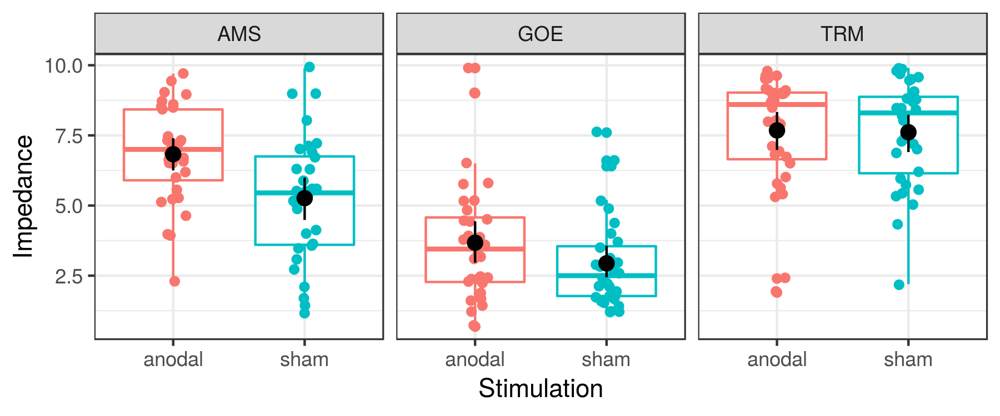

---
title:  'Supplemental Material: Compromised Effective Blinding for transcranial direct current stimulation at 1 mA for 20 min in Young Healthy Individuals'
journal: 'Brain Stimulation'
author:
- name: Zsolt Turi
  footnote: 2
- name: Gábor Csifcsák
  footnote: 1
- name: Nya Mehnwolo Boayue
  footnote: 1
- name: Per Aslaksen
  footnote: 1
- name: Andrea Antal
  footnote: 2
- name: Josephine Groot
  footnote: 1,3
- name: Guy E. Hawkins
  footnote: 4 
- name: Birte Forstmann
  footnote: 3
- name: Alexander Opitz
  footnote: 5
- name: Axel Thielscher
  footnote: 6,7
- name: Matthias Mittner
  footnote: 1
  corresponding: matthias.mittner@uit.no
affiliation:
- number: 1
  name: Department of Psychology, University of Tromsø
- number: 2
  name: Department of Clinical Neurophysiology, University Medical Center Göttingen
- number: 3
  name: Integrative Model-based Cognitive Neuroscience Research Unit, University of Amsterdam
- number: 4
  name: School of Psychology, University of Newcastle
- number: 5
  name: Department of Biomedical Engineering, University of Minnesota
- number: 6
  name: Danish Research Centre for Magnetic Resonance, Copenhagen University Hospital Hvidovre
- number: 7
  name: Department of Electrical Engineering, Technical University of Denmark
bibliography: references.bib   
...

# Supplemental Analyses

## Technical details for Bayesian analyses

All Bayesian analyses used four independent chains with 2000 samples each. We treated the first 1000 iterations as warm-up phase such that all inferences are based on 4000 iterations. We ensured that the Gelman-Rubin diagnostic [@gelman1992inference] $\hat{R}\le 1.05$ for all variables in all models. In addition, traceplots for all variables were visually inspected and no anomalies were found.
  
## Model-selection details
 
We tested a sequence of models of increasing complexity independently for each of the two outcome measures (guessing sham vs. anodal stimulation and discomfort caused by stimulation).
We started with a model that contains no factors (Null-model) and then added each of the factors (lab: AMS, GOE and TRM; stimulation-condition: sham vs. real) in various combinations. We also relaxed the assumption of homoskedasticity by testing models that allowed for unequal variances across labs and stimulation conditions. A summary of all models  is provided in Table \ref{tab:q6} for the blinding question and  in Table \ref{tab:q3} for the discomfort question. For each model, we list the estimated effect of the anodal stimulation and the leave-one-out cross-validation criterion (LOOIC; @vehtari2017practical).

\input{supp_tab_q6.tex}
 
For both the blinding and discomfort question, model-selection favored a model that included both stimulation and lab as factors. Including their interaction decreased the model-selection score (blinding: $\Delta$LOOIC=-3.97, SE=1.77; discomfort: $\Delta$LOOIC=-2.42, SE=2.76). Allowing unequal variances across labs or stimulation did not appear to strongly improve model-fit. We therefore report the model that included both Stimulation and lab as factors in the main paper. However, the conclusions drawn from this model, in particular with respect to the effect of real vs. anodal stimulation on blinding efficacy and discomfort, were robust against model choice: All models (except model 4 that included the interaction term) showed a positive effect of real stimulation on both questions with the posterior 95% interval exlucing zero. We 

\input{supp_tab_q3.tex}
 
Diagnostic plots as well as posterior-predictive checks for all tested models can be found at our github-repository: <https://github.com/ihrke/2018_tdcs_blinding/tree/master/analysis>.

## Achieved impedance as a moderator

Our experimental protocol required the impedance of the electrodes to be below 10 k$\Omega$ before the stimulation could be started. Even though that value is quite low in comparison to what other studies in the field use, it is possible that differences in impedance may have had effects on discomfort or the blinding properties of the protocol. In order to investigate whether there were differences in what impedances were realized across labs and stimulation condition, we ran a Bayesian ANOVA [@rouder2012default] with factors lab and stimulation condition and impedance at the start of the stimulation as dependent variable. Descriptive statistics for this variable are summarized in Figure @fig:impedance.

We found that 

{ #fig:impedance width=100% }

## Frequentist analysis treating ordinal scales as metric variables

Even though we believe that our reported Bayesian analyses are much more suitable for the analysis of ordinal-scale data [@liddell2018analyzing] we also report standard frequentist analyses that do not take the ordinal scale into account. We do this mostly of a desire to convince the reader that we did not cherry-pick our analysis method to achieve a particular result. Simple independent t-tests comparing sham vs. anodal stimulation find significant effects both for subjects guessing the stimulation condition ($t(185.9)=-2.38, p=0.018, d=0.34$) and skin sensations ($t(189.03)=-2.0, p=0.047, d=0.29$). The effect of actual stimulation condition on guessing stimulation condition is significant also when including lab-location in a 2 (sham vs. anodal) $\times$ 3 (lab: GOE, TRM, AMS) ANOVA, $F(1,186)=5.74, p=0.018, \eta^2=0.03$. In this analysis, neither the main effect of lab ($F(2,186)=2.67, p=0.07, \eta^2=0.028$) or the lab $\times$ stimulation interaction were significant ($F(2,186)=0.25, p=0.78, \eta^2=0.003$). A corresponding ANOVA with reported skin-sensations as dependent variable also showed stronger sensations during anodal stimulation ($F(1,186)=4.31, p=0.039, \eta^2=0.023$). For this question, the main effect of lab was significant ($F(2,186)=8.46, p=0.00030, \eta^2=0.083$) but the interaction between lab and stimulation was not, $F(2,186)=0.94, p=0.39, \eta^2=0.01$. 

# References {-}

<!-- -->

